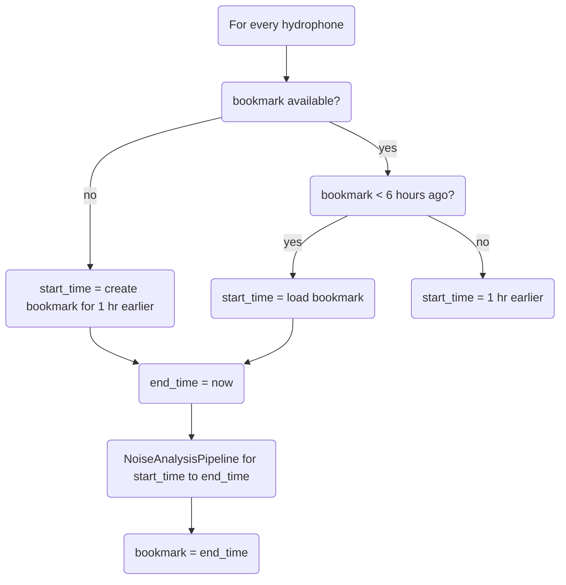

# Github Actions Automation for Ambient-Sound-Analysis

The following details the github actions scripts used for automatic data processing for [ambient-sound-analysis](https://github.com/orcasound/ambient-sound-analysis)

## Automated pipeline for sound file to Power Spectral Density (PSD) parquet files

See: git_action_psd_upload.py

### Purpose

The purpose of this github actions workflow is to asyncronously automate the processing of .ts sound files into a PSD and broadband parquet dataframe and publish the parquet files to an S3 bucket. The store of a PSD and broadband dataframe facilitates retrospective analyses of sound pollution and Orca call signals and their relationships.

### Script/Workflow Features

* Partitioning of parquet files by Hydrophone and date for the two datasets: PSD and Broadband.
* Bookmarking class, (similar to AWS glue bookmarking), that uses a json file uploaded to S3 as a bookmark to track data processed.
* Parallelization of data processing per hydrophone by using Github workflow matrix strategy.

### Script process

